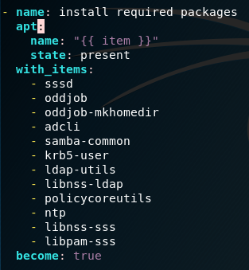
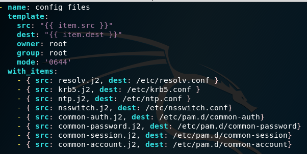
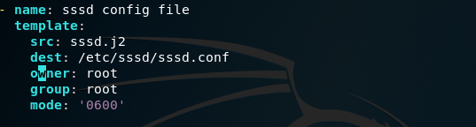
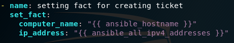
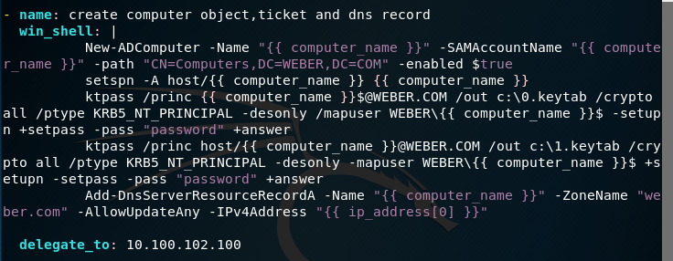
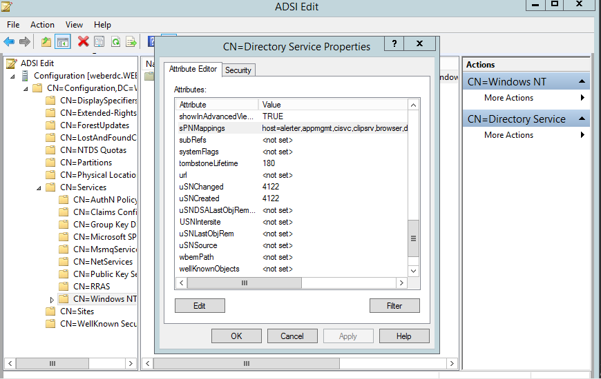
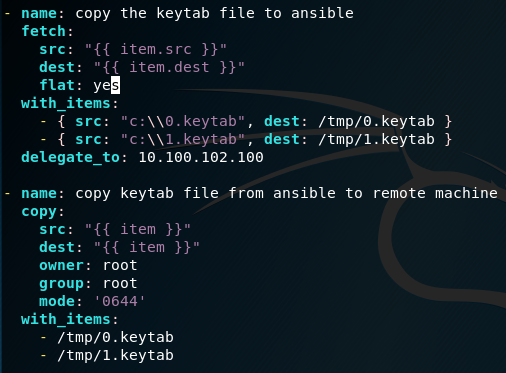
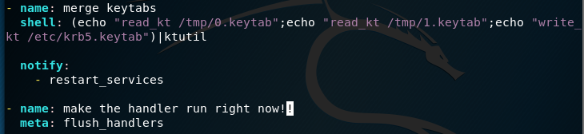

### Adding Ubuntu Machines to the domain with simple playbook

## Table of Contents
- [Explain about The Process](#Explain-about-The-Process)
  * [Installation Packages](#Installation-Packages)
  * [Config Files](#Config-Files)
  * [Sssd config file](#sssd-config-file)
  * [Setting up the facts](#setting-up-the-facts)
  * [Creating Computer Object, keytab and dns record](#Creating-Computer-Object-keytab-and-dns-record)
  * [Transfering Keytabs](#Transfering-Keytabs)
  * [Merging Keytabs](#Merging-Keytabs)
- [Tests](#tests)
- [Common Issues](#Common-Issues)
- [What is Keytab?](#What-is-Keytab?)
- [Run Example](#run-example)


### Explain about The Process

## Installation Packages
1)	The first thing we are doing is installing the required packages in order to add our machine to the domain, the packages are:



**sssd** --> the sssd provides access to remote identity and authentication providers, that means that it will provide us access to our domain.
**oddjob** --> this package provides access to unprivileged application to accomplish privileged task                                          
**oddjob-mkhomedir** --> this package will create us an home directory for each domain user who will connect to our machine.                   
**Adcli** --> normally used to create a computer object of our computer in the active directory, and bring its keytab file(we don’t going to use it because we are going to do this things manually, so for us this package is not very useful, and I will explain later on what is a keytab, but we use it because sssd uses it in order to change the keytab content every 30 days).                                                                                                              
**samba-common** --> normally used to authenticate with the domain and transfer a necessary keytab file through smb.(I downloaded this package for maintaining access to the SYSVOL folder if I would want (sysvol is the default share of each domain)).                                 
**Krb5-user** --> we use it for the krb5.conf file, that include information describing the default Kerberos realm(our domain name) and the location for the key distribution center (our domain controller).(it means that it will point us to our domain and domain controller).                 
**ldap-utils** --> this package is responsible of doing queries from the dc.(example: query information about user, service or computer.   
**libnss-ldap** --> this package is used if we are using ldap as our authentication service.(in our case we use the sssd, with Kerberos so it is not needed, but I downloaded it if I would want to change it).                                                                               
**Policycoreutils** --> this package is used to change selinux configuration, and adjust it to our purposes.              
**ntp** --> this package is used to synchronize our clock with the ad.(if our time is different we can’t authenticate to the domain).   
**libnss-sss** --> this package tells the sssd service where to search for our user name, permissions, groups and other.      
**libpam-sss** --> this package is used in order to authenticate our user.(pam is used in linux systems in order to handle authentication, you can modify their settings like: login timeout, how many passwords you need in order to access your account, if the account need password or not, and more…)


## Config Files
2) the second thing we do is to configure the necessary files:



**resolv.conf** --> contains the dns servers we use(in our case also the dc), and we also use the parameter search <domain name> , so it will add suffix to anything we will ping(for example if we ping for the workstation Ubuntu, it will add Ubuntu.<domain name>).          
**krb5.conf** --> contains which realm we are going to connect to(our domain name) , and also the name of our key distribution center(our domain controller).       
**ntp.conf** --> set who our ntp service provider(in our case it is the dc, and it will tell us to synchronize our clock according to the dc).
**nsswitch.conf** --> nss or naming switch system is telling our machine where to look for files of users who wants to authenticate(it also contains where is the groups file, shadow file and more), we add there the sss provider, so when we authenticate to our machine with domain account, it will know to search info about him using the sssd.                                    
**Common-auth** --> contain information about authentication to our machine, we add there the shared object called pam_sss.so so our machine could authenticate using sssd.                                            
**Common-password** --> contains information about password policy strength,
We add there the shared object called pam_sss.so so our machine could grab the password policy from our domain, and the password itself.        
**Common-session** --> contains information about our session when we authenticate to the machine, we add there 2 shared objects.
The first one is pam_oddjob_mkhomedir.so, so when we authenticate with domain account it will create a home dir for him if it does not exist.
The second one is the pam_sss.so so we could maintain our session with the policies from our domain controller.                               
**Common-account** --> contains information about the account who authenticate to our machine and what will happen with him, we add there the pam_sss.so so it will take information about our account, and policies about him for the domain.
you can notice the sss in the 4 file above, this is because they are all using sssd.
Moreover the 4 files above are under pam, pam is pluggable authentication method, this is in linux machines responsible to handle all the process of authentication, password policy, etc… 

## Sssd config file
3) the sssd config file:



In this file we add many configurations about where is our domain controller, we also tell him to use nss and pam as our authentication methods. Moreover, we have their information about where is the home dir of new members and many more.

## Setting up the facts
4) here we setting up the facts that we are going to use later.



These facts include our machine ip address and its hostname.

## Creating Computer Object, keytab and dns record
5) now we are going to create our computer object,our keytab files and we are going to also create a DNS record for it with this tiny script:



So the first line is creating a computer account, with his computer account name similar to the computer name(it is required, because, each computer in the active directory has computer account name like the computer name with a $ sign in the end).
The second line is creating something that called spn (service principal name), it is a unique identifier of a service in order to associate it with a user account (in our case we associate it with the computer user account).
We create the host spn and we associate it with our computer account.
The host spn contains some spns inside of him, this is something called spn mapping. It means, that our spn contains some spns inside of him.
In order to see what our spn mapping contains inside of him we need to open, adsiedit.msc --> configuration partition --> services --> windows NT --> directory services, right click --> and then under spn mappings you will see it. 



The next step we do is creating 2 keytab files.

## Transfering Keytabs
6) now we transfer the 2 keytabs to our machine like this:



## Merging Keytabs
7) then we are using tool called ktutil in order to merge this 2 keytabs into one file, and also calling and handler in order to restart services responsible for the changes we made.
We do it like this:



## Tests
now the last thing we did is to check if our keytab is working.
If it is working fine, we can now authenticate with a Kerberos authentication to our domain.
We run 3 test:
The first one is calling the command 
```bash 
klist –ke
```
 this is reading the keytab file and checking is content.
The second test we did is using the command 
 ```bash
 kinit
 ```
 in order to authenticate to the services, we have in the keytab file, and check if it works.              
And the third test we do is using the command called ldapsearch, in order to make and ldap query to our domain.
If all of the 3 tests succeed without any error, it means you can authenticate to your domain freely!! 


## Common Issues
1) the first mistake I did was to give all the pam files, and the nsswitczh.conf file permissions of ‘0600’. Because, I did this only root could read the file and not sssd, so when I authenticate to the domain, it didn’t know where to search for my account content (like the group file, password file, etc…), so it showed me that I am authenticating as “no name”.                                                                                                           
2) the second mistake I did was that I didn’t added the pam_oddjob_mkhomedir.so to the common-session file.


Because of that, any new member that was connecting to the machine didn’t manage to create its own home directory.
I added this as a session optional, so if it won’t succeed to make my user a home directory, it won’t make the authentication fail.
3 ) the last mistake I did was, that because I am using an Ubuntu 16.04 that has a known issue with Kerberos authentication I needed to add an extra line to my sssd.conf file. This line, make my account when it log in, to not try taking any gpos, because of the ubuntu known issue that will make the autentication fail if he will try to pull gpos.


4 ) the last mistake I did was that I gave the sssd.conf file the permission of ‘0644’. This will make the authentication fail because, this is a very important file and restricted, so it only works if only root can read it and have permission of ‘0600’


## What is Keytab?
Keytab (Key-Table) is a file containing a principal and a symmetric key for authenticating to the principal, so when it need to authenticate it won’t need to prompt for a password.
so in our case the server need to authenticate, so it can use the password that is saved in the keytab, and don’t need to prompt for password.
Because Kerberos work like this:
First thing the computer authenticate with the domain controller using a password (the symmetric key) and then users can authenticate in front of him.
In our case we created 2 keytabs, one for the computer account, and one for the host principal, this principal is used in order to allow local logins, ssh logins to the machine using Kerberos authentication.
We also set the parameter +setspn in the second principal, this is changing the user principal attribute of the computer object to the principal of the host/...
We did this because if we don’t do this, then it won’t recognize the principal.


## Run Example
```bash
ansible-playbook krb_auth.yml -i <hosts file> --extra-vars "dc_ip=<dc ip> domain_name=<domain name> dc_fqdn=<dc fully qualified domain name>"
ansible-playbook krb_auth.yml -i /etc/asnbile/hosts --extra-vars "dc_ip=192.168.10.10 domain_name=weber.com dc_fqdn=weberdc.weber.com"
```
